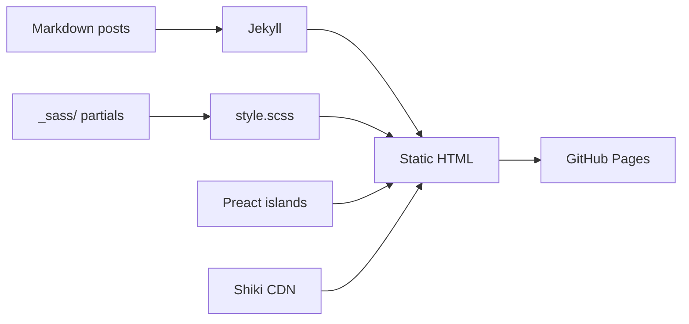

# Architecture

## Stack



| Layer           | Technology                         | Role                                    |
| --------------- | ---------------------------------- | --------------------------------------- |
| Static gen      | Jekyll 3 + kramdown (GFM)         | Markdown → HTML, layouts, includes      |
| Hosting         | GitHub Pages                       | Auto-deploys on push to main            |
| Styling         | SCSS + Tailwind CDN                | Design tokens via `_sass/`, utilities via CDN |
| Client JS       | Preact (CDN)                       | Island architecture for rich blocks     |
| Code highlight  | Shiki (CDN, `min-light` theme)     | Quality-first syntax highlighting       |
| Comments        | Giscus (GitHub Discussions)        | Post comments                           |

## Data Flow

### Build time (Jekyll)

1. Markdown posts in `_posts/<category>/` + `_drafts/` are processed by Jekyll
2. kramdown (GFM mode) converts Markdown to HTML
3. Layouts (`_layouts/`) wrap content with chrome (header, footer, styles)
4. Includes (`_includes/`) inject partials (analytics, giscus, meta tags)
5. SCSS (`_sass/` + `style.scss`) compiles to single CSS output
6. Output lands in `_site/`, served by GitHub Pages

### Client runtime (browser)

1. Page loads as static HTML — fully readable without JS
2. Preact runtime mounts on `#post` (post pages only)
3. Island components scan for `data-rich-block` attributes and hydrate:
   - `inline-gallery` — grid → carousel for 3+ images
   - `headline-image` — click-to-open full-size
   - `quote-block` — warm-accent styled callouts
   - `download-card` — file download tiles + overflow dialog
   - `about-experience` — expandable transcript entries
   - `post-toc` — table of contents generation
4. Shiki CDN (`run-shiki-highlighting.js`) replaces code blocks with token-colored output
5. Reading time estimate (`run-reading-time.js`) computes and displays estimate

## Design Authority

[DESIGN.md](../DESIGN.md) is the canonical UI contract. All visual decisions must align with its token map and component list. Components must be registered there before implementation.

## Key Design Decisions

- **Tailwind CDN over build pipeline** — avoids a local Node.js toolchain. DESIGN.md prohibits a local Tailwind build.
- **Preact over React** — smaller bundle, same API, loaded via CDN `<script type="module">`
- **Shiki over Rouge** — `_config.yml` still configures Rouge for server-side highlighting, but the preferred renderer for post code blocks is Shiki CDN. Server-rendered code remains readable as fallback.
- **Island architecture** — each rich block is a self-contained Preact component. No global state, no router. Static-first, JS-optional.
- **Devcontainer-only** — all development inside the container. No local Ruby/Jekyll setup. Avoids environment drift.

## Asset Pipeline

```
assets/js/
├── preact-runtime.js              # Preact + hooks (CDN snapshot)
├── runtime.js                     # Mount point — calls run*Enhancements for each island
├── run-shiki-highlighting.js      # Shiki CDN code block enhancement
├── run-reading-time.js            # Reading time estimate
└── components/
    ├── inline-gallery-island.js      # Image gallery → carousel
    ├── headline-image-island.js      # Click-to-expand images
    ├── quote-block-island.js         # Rich quote callouts
    ├── download-card-island.js       # File download tiles
    ├── about-experience-island.js    # Expandable transcripts
    ├── post-toc-island.js            # Table of contents
    └── rich-image-preview.js         # Shared image preview utility
```
